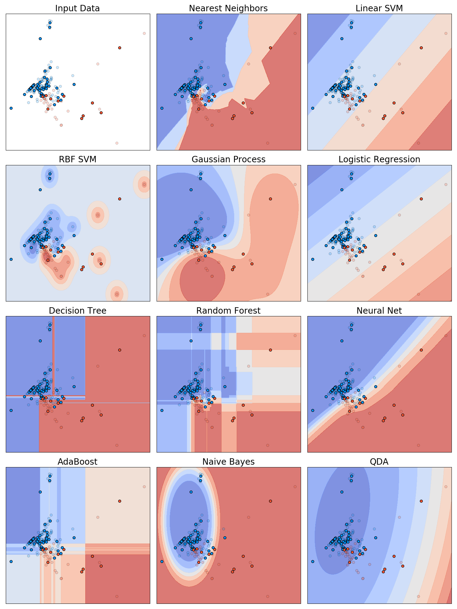

# Comparing Water Source Site Types and Predicting Contamination of Tap Water exposed to Per- and Polyfluoroalkyl Substances (PFAS) in the United States

## Data Source
PFAS data can be found from the United States Geological Survey’s (USGS) website providing different types and levels per state for years 2016 to 2021: https://www.sciencedirect.com/science/article/pii/S0160412023003069?via%3Dihub

## Public Supply vs Private Wells

Based from the figure below, there is no significant difference between water source site types in terms of PFAS contamination. 
  

  
A hypothesis test was also implemented to further support these visual findings. 

## Predicting PFAS Contamination in Tap Water

Different classifiers were applied on PFAS data to predict whether its contamination in a water source site is above or below EPA standards. The figure below shows the behavior of these classifiers with respect to the first two principal components of the data.
  

## Documentation
The paper and code will be provided upon request.
