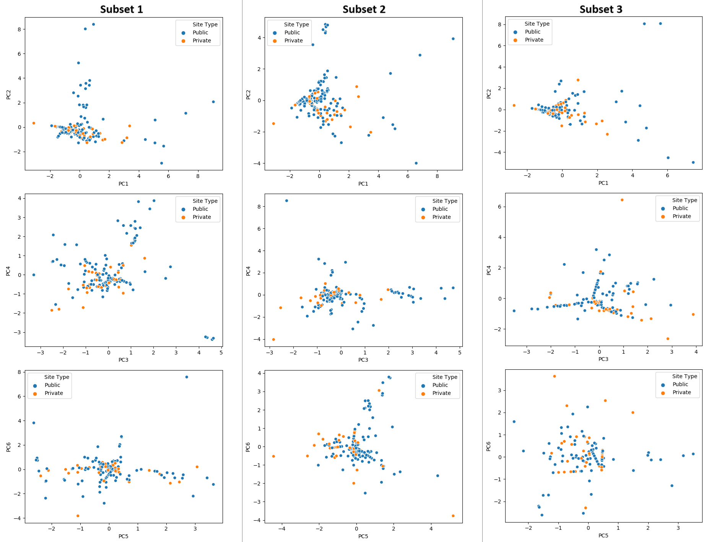

# PFAS-tapwater-contamination
Comparing Water Source Site Types and Predicting Contamination of Tap Water exposed to Per- and Polyfluoroalkyl Substances (PFAS) in the United States

## Data Source
PFAS data can be found from the United States Geological Survey’s (USGS) website providing different types and levels per state for years 2016 to 2021: https://www.sciencedirect.com/science/article/pii/S0160412023003069?via%3Dihub

## Public Supply vs Private Wells

Based on from figure below, there is no significant difference between water source site types in terms of PFAS contamination. 
 

